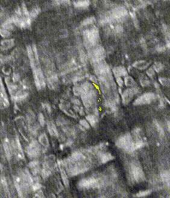
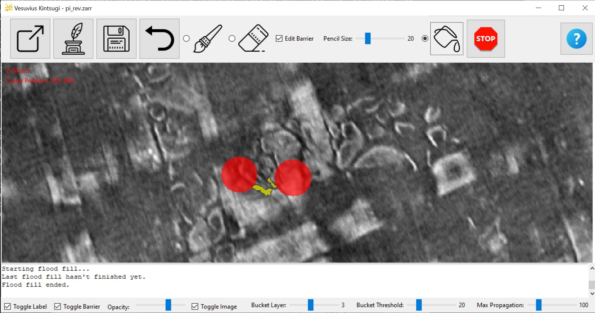

# Vesuvius Kintsugi

## Introduction

Vesuvius Kintsugi is a tool designed for the Vesuvius Challenge (https://scrollprize.org/) aimed at facilitating labeling 3D voxel data extracted from the Herculaneum scrolls. This tool alleviates the complexities of annotating 3D segments by providing an intuitive interface for manual segmentation and labeling of the "ink crackles", crucial for the creation of ground truth datasets necessary for machine learning ink detection models.

POUR GOLD INTO THE CRACKLES!


## Features

### Interactive UI
- A graphical user interface that enables users to navigate through 3D Zarr data, H5FS 3D images and a folder with multiple TIFFs (experimental).
- Tools for labeling including brush, eraser, and flood fill (3D bucket).
- Toggle visibility of labels, barrier masks, and original images.
- Adjust the transparency of label and barrier overlays.
- Undo feature to revert the last action.
- Switch between editing labels and barrier masks.

### Advanced Labeling Features
- A 3D flood fill algorithm to segment contiguous structures within the data.
- Configurable settings such as intensity threshold, bucket layer selection, and maximum propagation steps for precise control.
- Edit barrier masks to prevent the flood fill algorithm from propagating into restricted areas.

### Efficient Data Handling
- Loading and saving of Zarr formatted data directly from and to disk.
- Efficient support of H5FS 3D images.

### Accessibility and Assistance
- Tooltips provide guidance for each control.
- A help window offers detailed tool usage instructions.
- The interface is designed to be user-friendly and intuitive.

### Letter dataset
- A small Zarr dataset of cropped letters from Scroll 1 to practice labeling

## Installation

Before using Vesuvius Kintsugi, ensure that the necessary dependencies are installed.

- You can either create a virtual environment with
```console
$ pip install pipenv
```
and then, install the dependencies
```console
$ pipenv install
```

- alternatively, you can install directly the dependencies with:
```console
$ pip install -r requirements.txt
```

## Usage
Run the main Python script to launch the Vesuvius Kintsugi interface:
```console
$ pipenv shell # if you are using a virtual environment
$ python kintsugi.py
```
Use the provided buttons to load Zarr data or folders containing TIFF (experimental), navigate through slices, label regions, and save your work. The interface supports various annotation strategies suitable for different types of 3D structures.

You can also load H5FS files running the script with the following command line arguments:
```console
$ python kintsugi.py --h5fs-file=/path/to/file.h5 --axes=zxy --roi=3070-3900,2770-3100,1500-2000
```

Region of interest (`--roi`) is specified in original dataset coordinates (and the axes sequence matches dataset too), one must take care not to specify too big a volume, because it all goes into memory.

With `--axes`, one can specify what kind of axes sequence the original dataset has. This will be mapped so that `z` will be zoomable (depth), `x` will be horizontal and `y` will be vertical.

## Customization
Directly customize the pencil size, flood fill threshold, and maximum propagation steps from the UI to tailor the tool's behavior to your specific data and labeling needs.

## Contributing
We encourage contributions to enhance the functionality of Vesuvius Kintsugi.

- [kglspl](https://github.com/kglspl): Special thanks to kglspl for his outstanding contributions!


## Author
Dr. Giorgio Angelotti

For any inquiries or further information, please contact me at giorgio.angelotti@isae-supaero.fr

## License
This project is licensed under the MIT License - see the LICENSE file for details.


